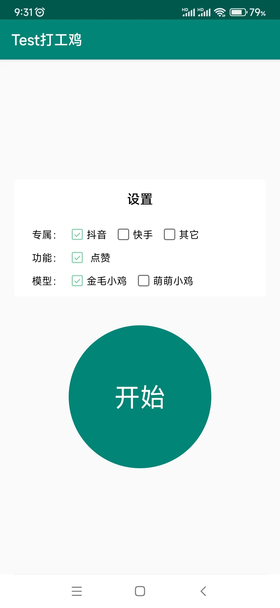

# BeanSproutAssistantAndroid
赤槿 - 打工鸡APP

## 初衷
    亲戚朋友在某音平台直播，想帮忙点赞拉拉人气，由于手动点赞太费时费力了，想开发出一款APP解放双手，利用APP有优势自动点赞。

## 功能介绍
    以鸡的形象展示，目前已有两个模型：【功德小鸡】、【萌萌小鸡】
        功德小鸡：眨眼睛、挥手、缩地闪现、功德+1；
        萌萌小鸡：开发中；

## 实现方式
    Android 利用无障碍服务，申请悬浮窗权限，做抖音点赞功能(模拟屏幕点击)。

## 展示

