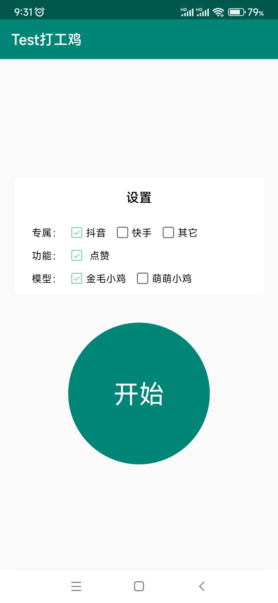
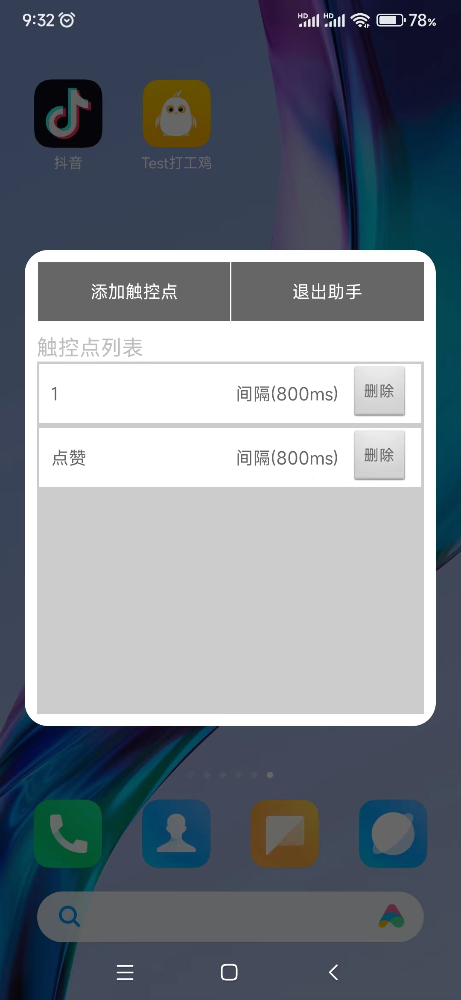

# BeanSproutAssistantAndroid (持续维护中)
赤槿 - 打工鸡APP

## 初衷
    亲戚朋友在某音平台直播，想帮忙点赞拉拉人气，由于手动点赞太费时费力了，想开发出一款APP解放双手，利用APP有优势自动点赞。

## 功能介绍
    主要包含功能：
        基本功能：登录、注册、检查更新。
        特色功能：定时点击、直播点赞、自动刷视频、自动看小说、直播间自动回复、抢福袋等。

## 模型介绍
    以鸡的形象展示，目前已有两个模型：【功德小鸡】、【跳绳小鸡】
        功德小鸡：眨眼睛、挥手、缩地闪现、功德+1；
        跳绳小鸡：眨眼、转圈、跳舞、扭动、呀呦、变身、跳绳；

## 实现方式
    Android 利用无障碍服务，申请悬浮窗权限，做抖音点赞功能(模拟屏幕点击)。
    自动回复中使用了UI Automator Viewer软件查找特定应用的ID，来进行控件控制。

## 账号规则
    新申请注册的用户提供免费体验15天限制，到期后可联系管理员改为正式用户(永久使用)。

## 展示
    启动前、首页、启动后、待机状态、打工中、设置、功德小鸡、跳绳小鸡；








## 下载体验
    请使用浏览器扫描此处，提供下载apk安装包，进行体验。


## 开发环境
    目前只支持Android 11以上版本，目前只支持Java + Xml开发，后续会支持Kotlin + Jetpack Compose开发。
|       语言                |                Android Studio                 |  AGP  | Gradle    |
|:------------------------:|:---------------------------------------------:|:-----:|:---------:|
| Java + Xml               | Android Studio Chipmunk(2021.2.1 Patch 2)     | 3.6.0 | 5.6.4     |
| Kotlin + Jetpack Compose | Android Studio Ladybug Feature Drop(2024.2.2) | 7.2.2 | 7.5.1     |

## 项目结构
com.example.app/
├── App.kt                     // 应用入口（Hilt 应用类，可选）
├── data/                      // 数据层：统一管理数据逻辑（本地+远程）
│   ├── repository/            // 仓库：协调本地/远程数据（核心）
│   │   ├── LoginRepository.kt // 登录相关数据逻辑
│   │   ├── UserRepository.kt  // 用户相关数据逻辑
│   │   └── BaseRepository.kt  // 仓库基类（封装通用逻辑，如错误处理）
│   └── model/                 // 数据模型（全局共享的数据类）
│       ├── User.kt            // 用户信息模型
│       ├── LoginRequest.kt    // 登录请求模型
│       └── LoginResponse.kt   // 登录响应模型
├── core/                      // 核心技术组件：通用能力（跨功能复用）
│   ├── datastore/             // DataStore 存储（键值对，如登录状态、Token）
│   │   ├── UserPrefs.kt       // DataStore 操作封装
│   │   └── PrefKeys.kt        // 存储键定义
│   ├── network/               // 网络相关（Retrofit 配置）
│   │   ├── ApiService.kt      // 所有接口定义
│   │   ├── RetrofitClient.kt  // Retrofit 实例化（OkHttp 配置）
│   │   └── ErrorHandler.kt    // 网络错误统一处理
│   ├── room/                  // Room 数据库（若需结构化存储，可选）
│   │   ├── AppDatabase.kt     // 数据库实例
│   │   ├── UserDao.kt         // Dao 接口
│   │   └── UserEntity.kt      // 实体类
│   ├── utils/                 // 工具类（无业务逻辑，纯通用工具）
│   │   ├── StringUtils.kt     // 字符串处理
│   │   ├── DateUtils.kt       // 日期处理
│   │   └── ToastUtils.kt      // 吐司工具
│   └── base/                  // 基础类（简化开发）
│       ├── BaseViewModel.kt   // ViewModel 基类（封装加载状态、Flow 收集）
│       └── UiState.kt         // UI 状态基类（Loading/Success/Error）
├── feature/                   // 功能模块：按核心业务划分（核心目录）
│   ├── login/                 // 登录功能（独立业务模块）
│   │   ├── ui/                // 登录页 UI（Compose 组件）
│   │   │   ├── LoginScreen.kt // 登录页主组件
│   │   │   └── LoginInput.kt  // 登录输入子组件（可复用）
│   │   └── viewmodel/         // 登录页 ViewModel
│   │       └── LoginViewModel.kt
│   ├── home/                  // 主页功能
│   │   ├── ui/
│   │   │   └── HomeScreen.kt
│   │   └── viewmodel/
│   │       └── HomeViewModel.kt
│   └── setting/               // 设置功能
│       ├── ui/
│       │   └── SettingScreen.kt
│       └── viewmodel/
│           └── SettingViewModel.kt
└── presentation/              // 表现层通用配置（全局共享）
├── theme/                 // Compose 主题（颜色、字体、形状）
│   ├── Color.kt
│   ├── Theme.kt
│   └── Type.kt
└── navigation/            // 导航配置（Navigation Compose）
├── AppNavGraph.kt     // 全局导航图
└── NavRoutes.kt       // 路由常量（如 "login"、"home"）

## Donate
    如果它对你帮助很大，在实际开发中切实的提升了您的工作效率和开发能力，并且你很想支持库的后续开发和维护,
    请您点击右上角 Star 支持一下谢谢!

## License
``` 
 Copyright 2024, 赤槿       
  
   Licensed under the Apache License, Version 2.0 (the "License");
   you may not use this file except in compliance with the License.
   You may obtain a copy of the License at 
 
       http://www.apache.org/licenses/LICENSE-2.0 

   Unless required by applicable law or agreed to in writing, software
   distributed under the License is distributed on an "AS IS" BASIS,
   WITHOUT WARRANTIES OR CONDITIONS OF ANY KIND, either express or implied.
   See the License for the specific language governing permissions and
   limitations under the License.
```