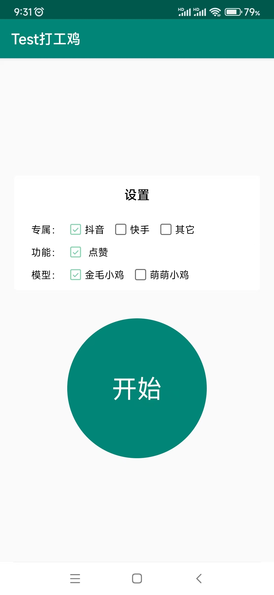
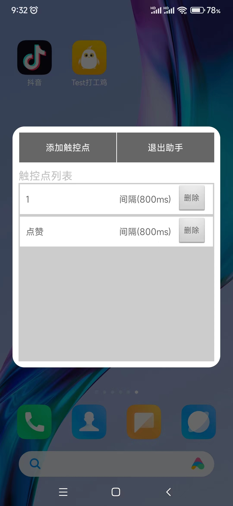
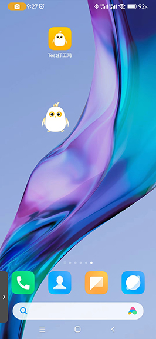
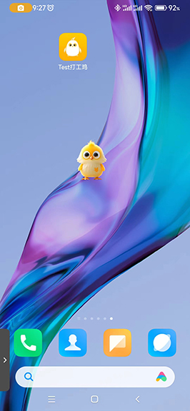

# BeanSproutAssistantAndroid (持续维护中)
赤槿 - 打工鸡APP

## 初衷
    亲戚朋友在某音平台直播，想帮忙点赞拉拉人气，由于手动点赞太费时费力了，想开发出一款APP解放双手，利用APP有优势自动点赞。

## 功能介绍
    主要包含功能：
        基本功能：登录、注册、检查更新、咨询反馈、开通会员。
        特色功能：定时点击、直播点赞、自动刷视频、自动看小说、直播间自动回复、抢福袋、自定义序列等。

## 模型介绍
    以鸡的形象展示，目前已有两个模型：【功德小鸡】、【跳绳小鸡】
        功德小鸡：眨眼睛、挥手、缩地闪现、功德+1；
        跳绳小鸡：眨眼、转圈、跳舞、扭动、呀呦、变身、跳绳；

## 实现方式
    Android 利用无障碍服务（AccessibilityService），申请悬浮窗权限，模拟屏幕点击实现自动操作。
    通过 AccessibilityNodeInfo 查找目标控件节点，结合坐标兜底策略适配不同机型的控件差异。

## 账号规则
    新申请注册的用户提供免费体验15天限制，到期后可联系管理员改为正式用户(永久使用)。

## 展示
    启动前、首页、启动后、待机状态、打工中、设置、功德小鸡、跳绳小鸡；










## 下载体验
    请使用浏览器扫描此处，提供下载apk安装包，进行体验。


## 开发环境
    支持 Android 7.0（API 24）以上版本，使用 Kotlin + Jetpack Compose 开发。
|       语言                |                Android Studio                 |  AGP  | Gradle    |
|:------------------------:|:---------------------------------------------:|:-----:|:---------:|
| Kotlin + Jetpack Compose | Android Studio Ladybug Feature Drop(2024.2.2) | 8.3.2 | 8.x       |

## 项目结构
```
com.wly.beansprout/
├── MyApplication.kt               // 应用入口（@HiltAndroidApp）
├── MainActivity.kt                // 单 Activity 架构（@AndroidEntryPoint）
├── core/                          // 基础设施层
│   ├── base/                      // BaseViewModel, UiState 密封类
│   ├── datastore/                 // DataStore 封装 + Hilt Module
│   ├── json/                      // JsonUtils 工具
│   ├── network/                   // RetrofitClient, ApiService, ErrorHandler
│   ├── permission/                // 悬浮窗权限适配（多厂商 ROM）
│   ├── utils/                     // 工具类（UMengManager, ApkDownloader 等）
│   └── TouchEventManager.kt      // 事件总线（StateFlow 单例）
├── data/                          // 数据层
│   ├── model/                     // 数据类（TouchPoint, CustomSequence 等）
│   └── repository/                // BaseRepository + 5 个具体 Repository
├── feature/                       // 功能模块层
│   ├── splash/                    // 闪屏 + 隐私政策
│   ├── login/                     // 登录
│   ├── register/                  // 注册
│   ├── home/                      // 首页（设置面板 + 启动按钮）
│   ├── touchpoint/                // 触控点管理
│   ├── tutorial/                  // 教程视频
│   ├── webview/                   // 协议页面
│   ├── feedback/                  // 咨询反馈（列表 + 提交 + 详情）
│   ├── member/                    // 开通会员咨询
│   ├── accessibility/             // 无障碍服务（AutoTouchService）
│   └── floating/                  // 悬浮窗服务 + 菜单弹窗
└── presentation/                  // 公共 UI 层
    ├── navigation/                // AppNavGraph + NavRoutes（13 条路由）
    ├── theme/                     // Material3 主题
    └── dialog/                    // 通用弹窗组件
```

## Donate
    如果它对你帮助很大，在实际开发中切实的提升了您的工作效率和开发能力，并且你很想支持库的后续开发和维护,
    请您点击右上角 Star 支持一下谢谢!

## License
``` 
 Copyright 2024, 赤槿       
  
   Licensed under the Apache License, Version 2.0 (the "License");
   you may not use this file except in compliance with the License.
   You may obtain a copy of the License at 
 
       http://www.apache.org/licenses/LICENSE-2.0 

   Unless required by applicable law or agreed to in writing, software
   distributed under the License is distributed on an "AS IS" BASIS,
   WITHOUT WARRANTIES OR CONDITIONS OF ANY KIND, either express or implied.
   See the License for the specific language governing permissions and
   limitations under the License.
```