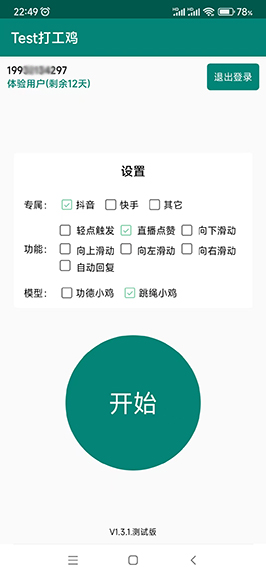

# BeanSproutAssistantAndroid (持续维护中)
赤槿 - 打工鸡APP

## 初衷
    亲戚朋友在某音平台直播，想帮忙点赞拉拉人气，由于手动点赞太费时费力了，想开发出一款APP解放双手，利用APP有优势自动点赞。

## 功能介绍
    以鸡的形象展示，目前已有两个模型：【功德小鸡】、【跳绳小鸡】
        功德小鸡：眨眼睛、挥手、缩地闪现、功德+1；
        跳绳小鸡：眨眼、转圈、跳舞、扭动、呀呦、变身、跳绳；

## 实现方式
    Android 利用无障碍服务，申请悬浮窗权限，做抖音点赞功能(模拟屏幕点击)。

## 展示
    启动前、首页、启动后、待机状态、打工中、设置、功德小鸡、跳绳小鸡；





## 下载体验
    请使用浏览器扫描此处，提供下载apk安装包，进行体验。
    

## Donate
    如果它对你帮助很大，在实际开发中切实的提升了您的工作效率和开发能力，并且你很想支持库的后续开发和维护,
    请您点击右上角 Star 支持一下谢谢!

## License
``` 
 Copyright 2024, 赤槿       
  
   Licensed under the Apache License, Version 2.0 (the "License");
   you may not use this file except in compliance with the License.
   You may obtain a copy of the License at 
 
       http://www.apache.org/licenses/LICENSE-2.0 

   Unless required by applicable law or agreed to in writing, software
   distributed under the License is distributed on an "AS IS" BASIS,
   WITHOUT WARRANTIES OR CONDITIONS OF ANY KIND, either express or implied.
   See the License for the specific language governing permissions and
   limitations under the License.
```